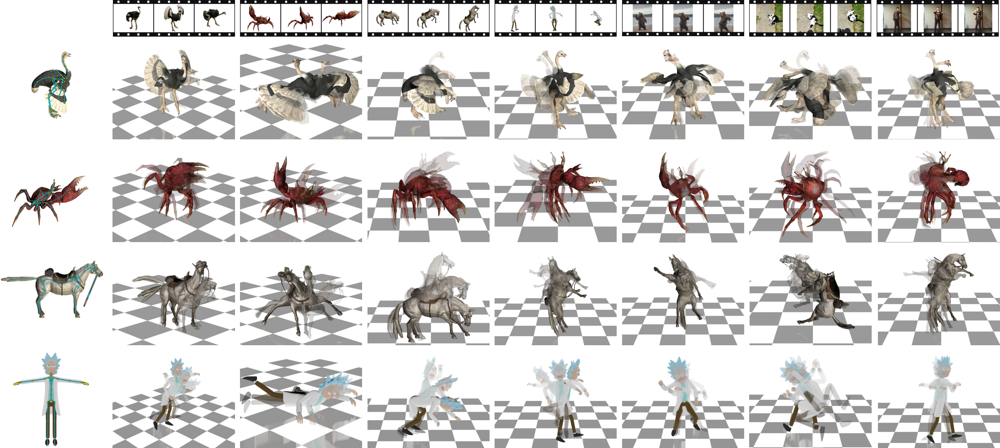

# CAST: Real-Time Motion Capture for Any Skeleton Topology

Anonymous Authors — under review.

[Project Page](https://cast-mocap.github.io/) · [Installation](docs/installation.md) · [Model Weights](#model-weights) · [Evaluation](#evaluation)



*CAST animates four target skeletons (left) from each of seven input clips (top).*

CAST captures motion from RGB video for target skeletons with different topologies.
It uses GRACE (Gated Rotation Alignment and CorrEction) for topology-aware
analytic rotation correction. This repository contains the CAST inference code.

## Installation

The reference environment uses Python 3.10, PyTorch 2.7.0, and CUDA 12.8.
Linux is the default installation target.

See the [installation guide](docs/installation.md) for environment setup,
CUDA operator compilation, backbone assets, and optional SAM2 mask generation.
[Windows-specific instructions](docs/installation.md#windows) are included there.

## Dataset Preprocessing

Zoo and Mobjaverse provide the RGB/mask caches used for training and the
validation metrics below. Mixamo is a separate **cross-skeleton evaluation**
dataset: a source character's video is paired with a different target
character's skeleton and reference motion. See the
[preprocessing overview](preprocess/README.md) and the individual guides for
[Zoo](preprocess/zoo/README.md), [Mobjaverse](preprocess/mobjaverse/README.md),
and [Mixamo](preprocess/mixamo/README.md) to build their caches.

## Model Weights

Download the CAST checkpoint and use its matching configuration:

| Model | Configuration | Checkpoint |
| --- | --- | --- |
| CAST-B · DINOv2 | [Config](configs/experiment/CAST_B_dinov2.yaml) | [Download](https://huggingface.co/CAST-mocap/CAST/resolve/main/CAST_B_dinov2.pt) |
| CAST-B · DINOv2 · without GRACE | [Config](configs/experiment/CAST_B_dinov2_no_grace.yaml) | [Download](https://huggingface.co/CAST-mocap/CAST/resolve/main/CAST_B_dinov2_no_grace.pt) |
| CAST-B · DINOv3 | [Config](configs/experiment/CAST_B_dinov3.yaml) | [Download](https://huggingface.co/CAST-mocap/CAST/resolve/main/CAST_B_dinov3.pt) |
| CAST-B · DINOv3 · without GRACE | [Config](configs/experiment/CAST_B_dinov3_no_grace.yaml) | [Download](https://huggingface.co/CAST-mocap/CAST/resolve/main/CAST_B_dinov3_no_grace.pt) |
| CAST-L · DINOv3 | [Config](configs/experiment/CAST_L_dinov3.yaml) | [Download](https://huggingface.co/CAST-mocap/CAST/resolve/main/CAST_L_dinov3.pt) |

Each CAST checkpoint also requires the corresponding pretrained DINO backbone.
Download and configuration instructions are provided in the
[backbone setup section of the installation guide](docs/installation.md#backbone-assets).

## Evaluation

### Matched-rig

To evaluate a released checkpoint on its matching skeletons, prepare the
[Zoo](preprocess/zoo/README.md) and
[Mobjaverse](preprocess/mobjaverse/README.md) caches and set their
`dataset_root` paths in the matching model configuration. Set the DINO backbone
paths as described in [Installation](docs/installation.md#backbone-assets),
and place the CAST checkpoint in `checkpoints/` with its original filename.

Select the `model` in
[`scripts/eval_video2motion_matched_rig.sh`](scripts/eval_video2motion_matched_rig.sh), then run:

```bash
bash scripts/eval_video2motion_matched_rig.sh
```

The script evaluates Zoo, Mobjaverse seen, and Mobjaverse unseen. Paper metrics
(MPJPE, PA-MPJPE, MPJVE, and J2J/CD) are saved to
`results/eval/matched_rig/<model>/metrics.json`.

### Cross-skeleton

Build the [Mixamo evaluation cache](preprocess/mixamo/README.md) and set its
path as `mixamo_cache` in
[`scripts/eval_video2motion_cross_skeleton.sh`](scripts/eval_video2motion_cross_skeleton.sh).
Select the `model`, configure its DINO backbone in the matching model
configuration, and place its checkpoint in `checkpoints/`, then run:

```bash
bash scripts/eval_video2motion_cross_skeleton.sh
```

The script evaluates every directed source-video to target-skeleton pair in
`pairs.jsonl` against the target character's reference motion. Per-pair,
per-target, and overall metrics are saved to
`results/eval/cross_skeleton/<model>/metrics.json`.

## Inference

To drive and render a target mesh from an RGB video, configure the matching
[DINO backbone](docs/installation.md#backbone-assets) and place the CAST
checkpoint in `checkpoints/`. In
[`scripts/inference_video2motion.sh`](scripts/inference_video2motion.sh), select
the `model` and set `input_video`, `static_path` (the target character's
`static.npy`), and `mesh_source`. Use the original skinned FBX for Zoo or
Mixamo, or the original `raw_data.npz` for Mobjaverse. Set `blender` for FBX
assets. Provide an existing mask through `input_mask_video`, or set
`sam2_checkpoint` and `sam2_model_cfg` to generate one.

Choose `lighting_preset` (`zoo`, `mobj`, or `mixamo`), then run:

```bash
bash scripts/inference_video2motion.sh
```

The script extracts the mesh, predicts its motion, and writes the rendered video
to `results/inference/<model>/<skeleton>/<video-name>/visualization.mp4`.

## License

The original CAST code is licensed under MIT; see [LICENSE](LICENSE).
Third-party code, model weights, and datasets retain their own license terms;
see [LICENSE-3RD-PARTY](LICENSE-3RD-PARTY) for bundled materials.

## Acknowledgements

We thank the authors of [MoCapAnything V2](https://github.com/phongdaot/MocapAnything)
for sharing their code, from which parts of our utility code are adapted.
We also thank the teams behind [DINOv2](https://github.com/facebookresearch/dinov2),
[DINOv3](https://github.com/facebookresearch/dinov3), and
[SAM2](https://github.com/facebookresearch/sam2) for making their code and
pretrained models available to the community.
